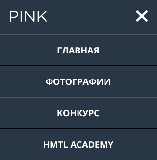

# Содержание

 1. [Цель](help-manual.md#1-Цель)
 2. Чек-лист
 3. Общая структура папок проекта
 4. Заготовки для html-страниц
 5. LESS__ORDER: структура less-каталога
 6. style.less: подготивительное оформление файла
 7. Чек-лист ещё раз
 8. Вспомогательные материалы

# 1. Цель
Подготовить общую структуру проекта для дальнейшей работы,
узнать о примесях/миксинах и переменных в LESS,
познакомиться с БЭМ

